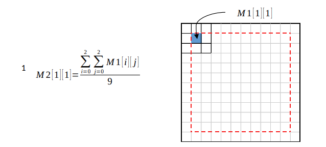
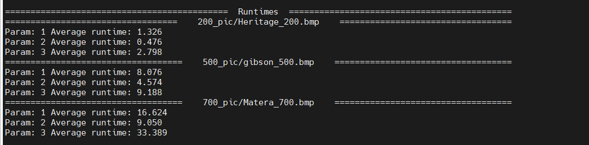
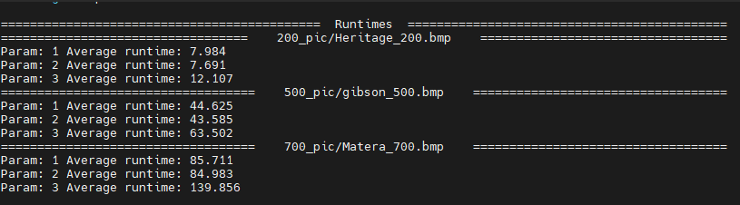

# Convolution_Optimization

## General Information
This program demonstrates the importance of writing code that runs fast.
In this exercise, I got the original working code-named ex_files(4).zip
My goal was to make the code run as fast as possible without changing the original output.
In this exercise, I could only change the following files: myfunction.c, myfunction.h,myfunction1.c and myfunction1.h .
### Instructions:
1. If the value is 1, the method performs smoothing of the image and then sharpening of the
smoothed image. Both the smoothed and sharpened images are saved as bmp files. The
writing process is conducted by a call the the method writeBMP, that is located in file
writeBMP.c
2. If the value is 2, the method performs a different smoothing and sharpening processes,
      and then writes the new images, as described above.
3. If the value is different than 1 or 2, the method performs smoothing that uses an
   additional filter, and then again performs sharpening. The new images are saved as
   described above.
4. In case no other value is input after the image, an error message will be shown and the
   program will be terminated.
 ### More details about Smoothing and Sharpening of an Image (Convolution)
Smoothing of an image is obtained by replacing every pixel by an average of the pixels
around it using window of some size, for instance a 3X3 window, where its center is the
original pixel location. Smoothing in RGB is done separately for each channel.
For example, given an image M1 of size NXN and some channel (R, G or B), the pixel in the
[1,1] location will receive the following value:

<br>
Where M2 is the image after smoothing 


## Setup
1. Clone the repository:
```
https://github.com/EtaiWil/Convolution_Optimization.git
```
2. Use the makefile attached and write  ``` make ```
3. Run the program as follow: ``` ./showBMP <imageName> <kernelOption> ```
for example: ```./showBMP gibson_500.bmp 1```

Another option to run the code is :

1. Clone the repository:
```
https://github.com/EtaiWil/Convolution_Optimization.git
```
2. Open Linux termianl and type: python3 compare.py <number> e.g python3 compare.py 20 . This command checks every picture 20 times on different values
and at the end shows the average running time of each picture size and values.


   
## Summery
In this code, I saw the meaning of writing code efficiently and seeing its benefits and impact on the speed of the result. One of the things that improved the speed of my code was to minimize memory touches as well as reduce duplicate calculations as much as possible.
In light of the above, you can see the result of my improvement compared to the source code after running it 20 times.

 
## My runtime


## Original runtime


## Built With

- C
## Author

**Etai Wilentzik**

- [Profile](https://github.com/EtaiWilentzik )
- [Email](mailto:etaiwil2000@gmail.com?subject=Hi "Hi!")
- [LinkedIn](https://www.linkedin.com/in/etai-wilentzik-b5a106212/ "Welcome")

## Support 🤝

Contributions, issues, and feature requests are welcome!

Give a ⭐️ if you like this project!
